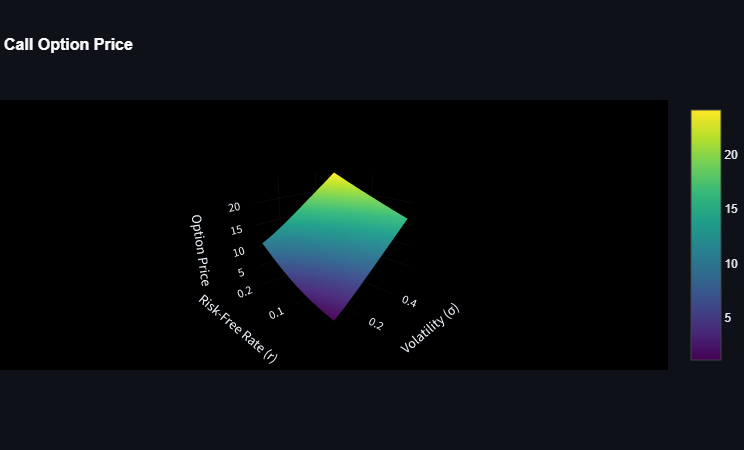
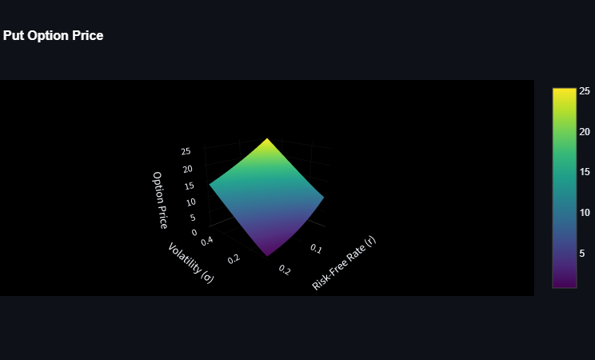

# 🧠 Black-Scholes Option Pricing

A Python implementation of the **Black-Scholes model** for pricing European call and put options. This project provides both a **command-line interface** and **interactive visualizations** for understanding how the model works, making it a valuable tool for students, financial analysts, and researchers.

## 📈 About the Project

The Black-Scholes model is a mathematical model for the dynamics of a financial market containing derivative investment instruments. This project:

- Calculates **European Call and Put option prices** using the Black-Scholes formula.
- Provides an interactive **Streamlit dashboard** for real-time option pricing.
- Includes **Matplotlib plots** for price sensitivity (Greeks).
- Supports analysis of option values based on input parameters such as volatility, time to maturity, and strike price.

## 🚀 Features

- 🧮 Black-Scholes formula implementation (both call and put)
- 📊 Streamlit-powered GUI for real-time option pricing
- 📉 Visualization of option prices and sensitivities
- 🔧 Easy-to-modify Python code with clear structure

## 📦 Installation

1. Clone the repository:

```bash
git clone https://github.com/Kamaal404/Black-Sholes-Option-pricing-.git
cd Black-Sholes-Option-pricing-
```

2. Create a virtual environment (optional but recommended):

```bash
python -m venv venv
source venv/bin/activate  # On Windows use `venv\Scripts\activate`
```

3. Install the required dependencies:

```bash
pip install -r requirements.txt
```

## 🖥️ Usage

### 1. Run the Streamlit app:

```bash
streamlit run deplo.py
```

> This will launch a browser window where you can interact with the pricing model.

### 2. Use the model directly in Python:

```python
from Black-Scholes import black_scholes_call, black_scholes_put

call_price = black_scholes_call(S=100, K=110, T=1, r=0.05, sigma=0.2)
put_price = black_scholes_put(S=100, K=110, T=1, r=0.05, sigma=0.2)
```

## 📚 Project Structure

```
Black-Scholes-Option-pricing/
│
├── Black-Scholes.py          # Main pricing formulas and 3D Matplotlib plots
├── deplo.py                  # Streamlit dashboard
├── requirements.txt
└── README.md
```

## 📷 Sample 3D Plots

### Call Option Price Surface
  <!-- Placeholder image path -->

### Put Option Price Surface
  <!-- Placeholder image path -->

## 📌 Parameters Explanation

| Parameter | Description                         |
|----------:|-------------------------------------|
| `S`       | Current stock price                 |
| `K`       | Strike price                        |
| `T`       | Time to maturity (in years)         |
| `r`       | Risk-free interest rate             |
| `sigma`   | Volatility of the underlying asset  |

## 🧠 Formula Used

The Black-Scholes formula for a **Call Option** is:

\[
C = S \cdot N(d_1) - K \cdot e^{-rT} \cdot N(d_2)
\]

Where:

\[
d_1 = \frac{\ln(S/K) + (r + \sigma^2/2)T}{\sigma \sqrt{T}}, \quad
d_2 = d_1 - \sigma \sqrt{T}
\]

Similarly, for a **Put Option**:

\[
P = K \cdot e^{-rT} \cdot N(-d_2) - S \cdot N(-d_1)
\]

## ✅ TODO / Future Improvements

- Add support for American options
- Implement Greeks (Delta, Vega, Theta, Rho)
- Add unit testing
- Add option pricing from historical market data

## 🙌 Contributing

Pull requests are welcome. For major changes, please open an issue first to discuss what you would like to change or improve.

## 📄 License

This project is licensed under the [MIT License](LICENSE).

## 👨‍💻 Author

- [Kamaal404](https://github.com/Kamaal404)
